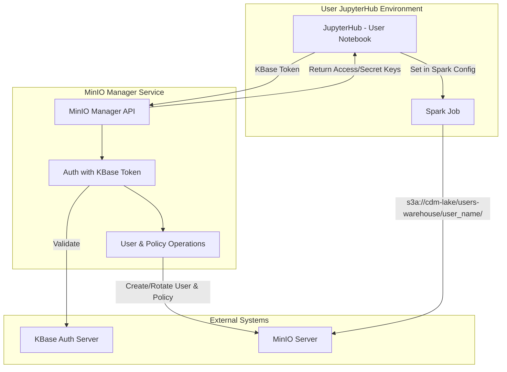

# MinIO Manager Service: High-Level Design & Product Summary

## 1. Overview
The **MinIO Manager Service** is a centralized FastAPI-based component that programmatically manages MinIO users, groups, and policies to enforce per-user and per-group data governance. Downstream applications-especially Apache Spark jobs running in JupyterHub-will call its RESTful APIs to obtain temporary credentials and enforce bucket-level read/write policies **without changing any Spark application code**.

## 2. Objectives
- **Dynamic Credentials**: Issue or rotate per-user MinIO credentials on demand, scoped to that user’s namespace.
- **Policy Enforcement**: Maintain user- and group-level IAM policies in MinIO, automatically updating them as projects evolve.
- **Seamless Integration**: Require zero changes in Spark job code; all credential & policy wiring happens at runtime via configuration.
- **No Secret Storage**: To maintain security and reduce complexity, the service itself holds only the MinIO `root` admin keys; user secrets are generated and returned transiently.
- **Self-Service MinIO UI Access**: Users receive their temporary access key and secret key on JupyterHub and can use them to log in via MinIO’s UI or API to browse and manage their own and shared data within their permission scope.

## 3. Key Features
- **User Management**
  - Create/rotate MinIO user with a unique access/secret key pair.
  - Assign a per-user `home` path (Create if it doesn't exist):  
    ```
    s3a://cdm-lake/users-warehouse/{user_name}/
    ```
  - Automatically generate and attach a policy granting `GetObject`, `PutObject`, `ListBucket`, `DeleteObject`, etc. on that path.

- **Group Management**
  - Create named groups (e.g. `KBase`, `BER`, `CDM_Science`).
  - Assign users to groups; inherit group policies in addition to personal policies.
  - Manage cross-user sharing: add/remove group-level permissions on shared prefixes.

- **Policy Lifecycle**
  - **Create**: On new user/group.
  - **Read**: Inspect current policy for drift detection.
  - **Update**: Add or revoke permissions when share/unshare operations occur.
  - **Delete**: Clean up stale users/groups and policies.

- **Token-Based Auth**
  - Clients authenticate by including their KBase token (or, in the future, an SSO/JWT) in the request header—this token is already available from the user’s JupyterHub session.
  - MinIO Manager validates token via KBase Auth Server, then issues MinIO keys scoped to user.

## 4. High-Level Architecture


## 5. Primary API Endpoints (Example-WIP)

| Endpoint                  | Method | Description                                              |
|---------------------------|--------|----------------------------------------------------------|
| `/users/{user}`           | GET    | Get user info & current policy.                          |
| `/users/{user}`           | POST   | Create or rotate user credentials & policy.              |
| `/users/{user}/share`     | POST   | Grant path-level access between users/groups.            |
| `/users/{user}/unshare`   | POST   | Revoke path-level access.                                |
| `/groups/{group}`         | GET    | List group members & policy.                             |
| `/groups/{group}`         | POST   | Create or update group policy.                           |
| `/admin/users`            | GET    | List all users.                                          |
| `/admin/groups`           | GET    | List all groups.                                         |
| `/admin/users/{user}`     | DELETE | Delete user.                                             |
| `/admin/groups/{group}`   | DELETE | Delete group.                                            |

## 6. Data & Control Flow

1. **Login from JupyterHub**  
   - JupyterHub requires a KBase token to be set in each user's session.  
   - Endpoints from MinIO Manager Service validates token via KBase Auth Server, resolves user identity.

2. **Credential Issuance**  
   - JupyterHub automatically calls `/users/{user}` for each user on login.  
   - If user doesn’t exist, service calls `mc admin user add` + `mc admin policy add`.  
   - If exists, service rotates the secret key and re-attaches policy.  
   - Returns temporary access/secret key pair.

3. **Spark Configuration**  
   - Notebook helper code runs:  
     ```python
     spark.conf.set("spark.hadoop.fs.s3a.access.key", ACCESS_KEY)
     spark.conf.set("spark.hadoop.fs.s3a.secret.key", SECRET_KEY)
     spark.conf.set("spark.sql.warehouse.dir", f"s3a://cdm-lake/users-warehouse/{USER}/")
     ```
   - Spark jobs now transparently respect MinIO policies.

4. **Sharing / Group Updates**  
   - User invokes helper `.share(path, with_group)` -> calls `/users/{user}/share`.  
   - Service updates group policy to include new prefix.  
   - All group members instantly gain/revoke access at the MinIO layer.
